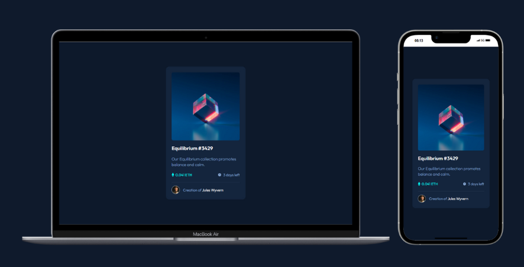

# NFT preview card component

🖱️ [View Website](https://your-live-site-url.com)

## Visão Geral

### Desafio

Este é um desafio do Frontend Mentor onde o objetivo é criar [este componente](https://www.frontendmentor.io/challenges/nft-preview-card-component-SbdUL_w0U) de cartão de visualização.

### Habilidades/Técnicas

- HTML
- CSS
- Flexbox
- Position
- Git

## Autor

Pedro Wagner - Front End Developer

