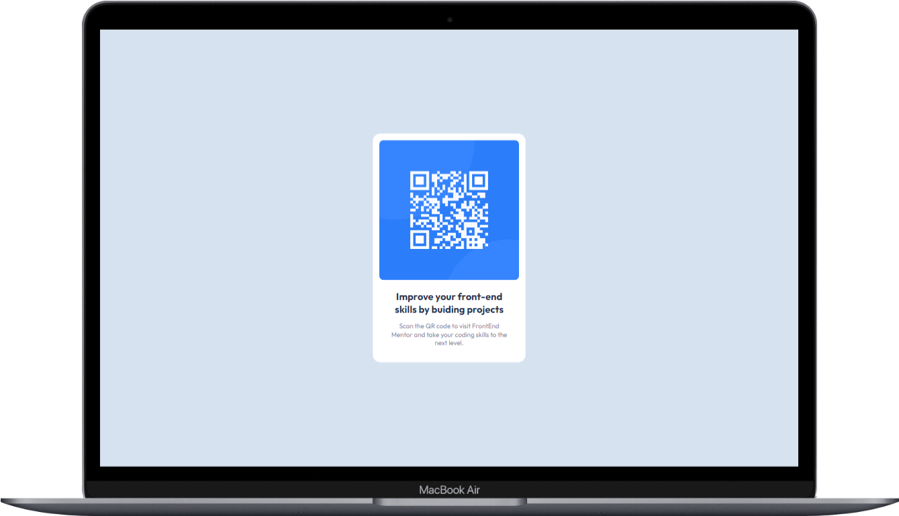

# QR-code component

- [Deploy](https://pedrowfilho.github.io/challenges/frontend-mentor/newbie/qr-code/)  

- [Frontend Mentor](https://www.frontendmentor.io/solutions/soluo-utilizando-html5-css3-e-flexbox-t_rRmK7cqY)

### Desafio
Construir um componente QR-code component e fazer com que fique o mais próximo possível do design disponibilizado.

### Habilidades/Técnicas
 - HTML
 - CSS
 - Flexbox
 - Git

## Autor

Pedro Wagner - Front End Developer

